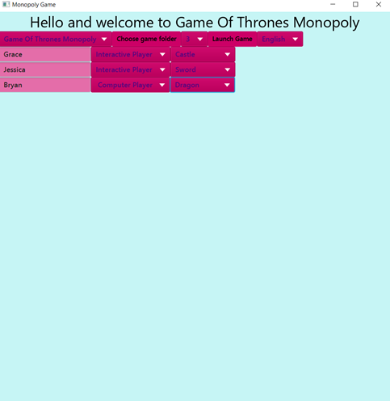
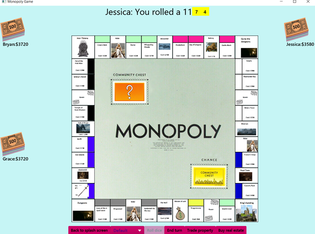

final
====

This project implements a player for multiple related games.

Original Team: Anna Diemel, Cameron Jarnot, Delaney Demark, Grace Llewellyn, and Lina Leyhausen, 

Refactored alone by: Grace Llewellyn

### Running the Program
####  Instructions
0. Download OpenJDK **full** package [here](https://bell-sw.com/pages/downloads/#/java-14-current). Download OpenJFX [here](https://openjfx.io/). 
1. Clone the git repository at [github.com/gllewellyn19/monopoly-game](https://github.com/gllewellyn19/monopoly-game)
2. Open your terminal and navigate into the cloned repository
3. Run `cd out/artifacts/monopoly_game_jar`
4. Run the command: `java -jar monopoly-game.jar`

### Primary Roles
* Grace: Frontend, Connecting the different parts of the project, GameView and GamePlay, Controller, Main, Most buttons, Splash screen, Refactoring, Error catching, Game of Thrones Monopoly, Dice (front and backend), Different player starting and rotation types, Reading class types from properties file, File structure, Factories
* Cameron: Board space logic, Connecting frontend and backend when a space is landed on, Turns, Duke theme, Board space factory, Backend money updates, Bank
* Anna: Data reading, Mortgaging, Trading, Real estate, Players, Money display, Property, Initializing game, Junior Monopoly
* Lina: Frontend, Data reading, Prompting user based on space, Board display, Classic monopoly
* Delaney: All things related to Cards, Rulesets, Player hierarchy, Turns, Spaces, Parks theme, Tests

### Features still being worked on
* Computer player actions
* View of buying real estate

## Overall Design
The design of our monopoly game is broken into a view, a model, and a controller. In the model, the program maintains the players, the decks of cards, the board spaces, and the mechanics of game play. This is where details about which board spaces and cards the game is using are read in from data, as well as specific rules that are mutable between the types of monopoly the program supports. The GamePlay class of the model retrieves the information from the data readers and instantiates the players, cards, and board based on the user?s chosen sets of data. Using the model instances, the GamePlay and TurnModel classes are able to have players roll dice, land on spaces, draw cards, and buy properties. 
   
All of the different components of the game of Monopoly are created within the various packages within the model. For example, there are packages for creating and handling the board spaces, the board made of board spaces, the bank, the card decks, the players, the real estates, the dice, and the different rules of the games. In order to initialize the start of the game, there are the data readers that parse required data for a game of Monopoly, and a package that determines how the player starts the game (i.e. random start, youngest starts). For many of these components, there are factories for objects that depend on data for initialization.	

The view part of the project contains the aspects of the visualizations that correspond to objects created on the backend, such as the board and the player statistics. There is also a package for handling the way that player turns are reflected in the view. Additionally, there are aspects of the view that are organized into the purposes they serve solely within the view, which includes the buttons and the pop-ups. These classes were separated into their own packages due to the sheer number of uses and variations for the buttons and pop-ups within the view.
   
Through interfaces and through the controller, the model is also able to communicate with the view. When the game is started, the controller is able to start the GamePlay and GameView and set them up with the resources the user specifies. Beyond that, the model is able to communicate with the view that updates to the graphics should be made and get user input through interfaces. This helps as the user is taking a turn and having that turn reflected on the board.

### My Design Justification
I created the overall design of our project and nobody had any objections to this design. I was typically the main design person for this project and if people had a question about the design they came to me. After going to my professor?s office hours, I decided to have all of our classes on the highest level of model/ view be abstract and I believe this was a really strong decision. This also allowed me to put optional keys in the properties file where people could put the subclass to use of these abstract classes. This was a huge step that allowed my code to follow open closed principle. Also, it was my decision to put defaults in the factories so that if the user entered a value wrong or didn?t enter a value they could still play the game. I created the file structure for the project and chose to put the interfaces in the same packages as the classes that implement them and I put all the exceptions in one package because they are thrown throughout the project. On a high level, I worked in the controller, GamePlay and GameView and put together the turns of the user rolling the dice, etc. I created all the interfaces in this project except for Promptable and I feel I did a good job following interface segregation principle because I only gave classes interfaces that I thought they needed. I also worked with the display and model dice and made the decision that the model was the one to calculate the dice roll and view just showed it. Also the model dice sum a dice roll and determine if a dice roll is doubles itself so that the design is more flexible if the user wants to have different types of dice (i.e. doubles can be determined how the user wants). I worked extensively with player rotation and starting types to make the design flexible and allow the user to specify the type that they would like in the properties file. I also did a lot of refactoring of the GamePlay, GameView, and ButtonsMaintainer classes that divided up their responsibility to better follow single responsibility principle. I also created the entire splash screen in a way that allowed for language changes and followed open closed principle since the users could specify the buttons that they wanted on the screen (in the default starting properties file in resources). I also created all of the buttons (except yes, no and continue) in a way that follows interface segregation principle and also gave the buttons control of what they needed to have. I created most factories. I also worked briefly with display money and display pieces to make the design more flexible if the user does not give the required information (i.e. display pieces lets the user choose from colored rectangles if they don?t give actual player pieces). 

### Resources Used
* Chance cards
	* [Textbooks](http://clipart-library.com/clipart/pcqKd9nRi.htm)
	* [Flunch](https://www.dukestudentgovernment.org/flunch)
	* [Chapel](https://issuu.com/dukechapel/docs/2019brochure)
	* [Excuse](https://i.pinimg.com/originals/52/7f/37/527f375403d130eca7c4202d82a2dfc1.jpg)
	* [zzz](http://clipart-library.com/clipart/7433.htm)
	* [Student](https://www.shutterstock.com/image-vector/sad-student-sitting-class-books-next-534415453)
	* [DukeHub](https://www.google.com/search?q=dukehub&tbm=isch&ved=2ahUKEwiQo8-Am4btAhVFz1MKHUbeBeAQ2-cCegQIABAA&oq=dukehub&gs_lcp=CgNpbWcQAzICCAAyBAgAEBgyBAgAEBgyBAgAEBgyBAgAEBgyBAgAEBgyBAgAEBgyBAgAEBgyBAgAEBg6BAgjECc6BAgAEEM6CAgAELEDEIMBOgcIABCxAxBDOgUIABCxAzoGCAAQBRAeOgYIABAKEBhQqqRBWKqpQWCuqkFoAHAAeACAAVmIAdQEkgEBN5gBAKABAaoBC2d3cy13aXotaW1nwAEB&sclient=img&ei=4P2xX5CzAsWezwLGvJeADg&bih=766&biw=1440&safe=active#imgrc=eF3CurDCydrC_M)
	* [TA](https://www.vexels.com/png-svg/preview/128130/lady-teacher-cartoon)
	* [Birthday cake](http://clipart-library.com/clipart/8TA6xz89c.htm)
	* [Tent](https://www.iconfinder.com/icons/2328047/recreation_outdoor_tourist_camping_travel_cartoon_tent_icon)

* Real estate
	* [Hollows](https://surface678.com/project/duke-university-edens-quad/)
	* [Few](https://bakerroofing.com/duke-university-few-quad/)

* Player pieces
	* [Cassius](https://www.marsreel.com/cassius-stanley-leaves-behind-a-lasting-legacy/)
	* [Tre Jones](https://goduke.com/sports/mens-basketball/roster/tre-jones/11775)
	* [Jon Scheyer](https://balldurham.com/2020/06/16/recruit-duke-basketball-jon-scheyer/)
	* [Chapel](https://www.ourstate.com/duke-chapels-bell-tower-joyful-noise/)
	* [Blue Devil](https://bustingbrackets.com/2019/09/21/duke-basketball-blue-devils-2019-20-season-preview/)
	* [Zion](https://www.newsobserver.com/sports/college/acc/duke/article243050931.html)
	* [Laettner](https://vault.si.com/vault/1991/11/25/devilishly-different-dukes-christian-laettner-is-pivotman-and-paradox-agile-giant-trash-talking-preppy-angelic-bruiser)
	* [Coach K](https://www.dukebasketballreport.com/2019/2/19/18224540/meet-dan-priatko-a-man-coach-k-admires-greatly-west-point-duke-basketball)

* Money
	* [DukeCard](https://www.cr80news.com/news-item/dukes-id-system-closes-in-on-one-millionth-number/)

* Board space images
	* [Money](https://www.amazon.com/Simple-Traditional-Money-Cartoon-Sticker/dp/B074CLSN95)
	* [Mail](https://pixabay.com/vectors/cartoon-e-mail-envelope-icon-mail-1295190/)
	* [Devil's Bistro](http://thefoodfactory.letseat.at/?mobile=0)
	* [Doctor](http://www.cliparthut.com/doctor-cartoon-clip-art-clipart-jNs5uK.html)
	* [Baldwin](https://www.youvisit.com/tour/photos/duke/133627?id=987245)
	* [Price](https://duke.edu/about/leadership/price/)
	* [Duke logo](https://www.brandsoftheworld.com/logo/duke-2)
	* [Books](http://www.aavictoria.org.au/literature-sales/books-cartoon/?doing_wp_cron=1605502947.7715919017791748046875)
	* [Marine lab](https://www.greenroofs.com/2011/08/27/gpw-duke-university-ocean-conservation-center-occ/)
	* [Food](http://clipart-library.com/clipart/6ip5jAXMT.htm)
	* [Gavel](https://webstockreview.net/image/gavel-clipart-cartoon/2744390.html)
	* [Palm trees](https://favata26.rssing.com/chan-13940080/all_p173.html)
	* [West campus](https://tclf.org/duke-university-%E2%80%93-west-campus)

### Running the Program

Main class: **src/ooga/Main**

Data files needed: One full set of the Monopoly folders or include your own by including:
* boardspaceimages
* changecardimages
* communitycardimages
* playerpieceimages
* realestateimages
* a monopoly board csv
* a board space images csv corresponding to monopoly board csv
* chance csv
* community chest csv
* properties.properties file

Features implemented:
* Turns
* Board display
* Trading properties
* Mortgaging properties
* Adding real estate to properties
* Community chest/chance cards
* Language options
* Theme options
* Interactive and computer players
* Flexible player number

### Notes/Assumptions

Assumptions or Simplifications:
* Should give in a number of board spaces divisible by 4
* Unlimited buildings and money- no longer weighted down by worrying about creating physical products
* Some assumptions about how data files are formatted
* Enumerated types for cards
* Limited (but abstractable) board space types
* Language level is Java 14 (preview)
* Maven libraries: org.testfx:testfx-junit5:4.0.16-alpha and com.opencsv:opencsv:5.2