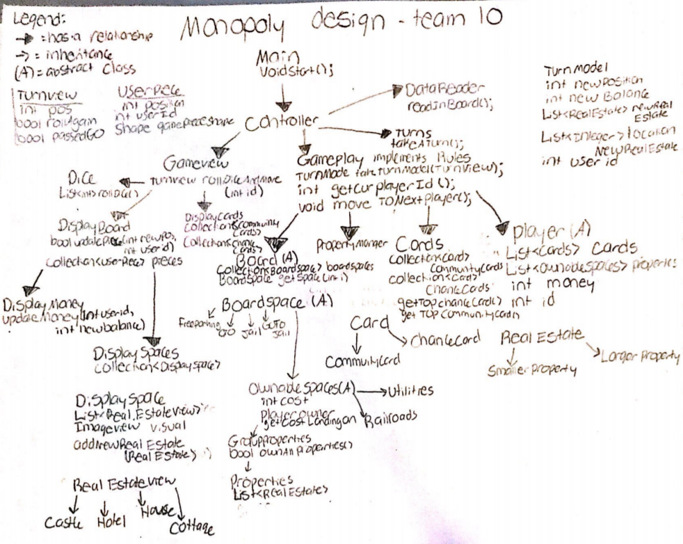

## Introduction

Our team plans to make Monopoly. Gameplay will support different rules— short game rules, official Monopoly rules, timed game rules— and themes. In particular, we want to implement Dukeopoly, classic Monopoly, and Game of Thrones Monopoly. We also want to add a lot of extra features to the project since we have a large group.

Our main priority in the codebase is backend design and development. We are all more interested in backend than frontend and plan on using this to implement a great backend. In addition, we are prioritizing codebase design; we want to be able to easily add new rules/themes to the codebase, so a robust design is incredibly important.

## Overview

### Description of classes:
* Main: overrides Application and creates start (stage, scene, animation) and step. Calls the ooga.controller to handle each step
* Controller: Connects the front end and the back and calls the ooga.model.DataReader to read in data. Calls the Turn class so that it can simulate the calls of taking a turn (requires calls to methods in both GamePlay and GameView
* ooga.model.DataReader: Create objects to pass to the ooga.view and ooga.model classes so that the board can be initialized. These objects are going to be created by reading from a csv, properties file, etc.
* ooga.model.turns.TurnsClassicMonopoly: Follows the steps for taking a turn in monopoly (takes the responsibility away from the ooga.controller)
* GamePlay: (name might change) main ooga.model classes that handles all the aspects of the ooga.model classes
* TurnModel: object that holds everything that needs to be held from a turn in the ooga.model
* Player: highest level will be abstract and will have instance variables needed for the user such as a unique ID
* Cards: Maintains a stack of cards for the game (most likely a collection of chance and community cards)
* PropertyManager: Keeps track of all available and owned properties in the game
* Board: Highest level is abstract. Maintains a collection of board spaces to represent the board and returns a BoardSpace based on where the user landed 
* BoardSpace: Highest level is abstract. Represents the different spaces on the board that have different functions such as go, etc. Implemented by these smaller classes. Will also need interfaces for control 
* OwnableSpaces: This is an abstract class that is only implemented by board spaces that can be owned by a user which includes but is not limited to railroads, properties, and utilities. 
* TurnView: Holds all the information that needs to be sent to the ooga.model after a turn (where the user went, what the user chose, etc.)
* GameView: Maintains all of the ooga.view for the game including the board and the graphics of the Cards
* Dice: Shows the visual of rolling the dice and actually gets the value from the dice roll
* DisplayBoard: Manages the DisplayMoney and DisplaySpaces for the board. Also has a collection of UserPieces that move across the board
* DisplayMoney: Shows the money for the user- will probably just show a generic picture of money and show the user their balance
* DisplaySpaces: Holds all the different spaces on the board and their visual representations which will probably be based on an actual monopoly board. In charge of creating the display of these spaces
* DisplaySpace: the actual space that is held in DisplaySpaces
* UserPiece: Holds the shape, location and user id for each users piece
* DisplayCards: not only shows the cards in the middle but also shows the card that is on top when the user clicks a card
* RealEstateView: has the different types of real estate that can be displayed on the board like house, castle, hotel, cottage, etc.

## Design details
* Main class
* ooga.model.DataReader

The Main class and ooga.model.DataReader exist on their own. The Main class is used to initialize and start the game, and will call on GamePlay and Display. ooga.model.DataReader will be used to read in the program’s CSV files and will supply this capability to the Display classes, which will add them to the screen.
###Display:
* DisplayBoard
* DisplayMoney
* DisplaySpaces
* DisplaySpace
* DisplayCards

The Display classes handle the displaying of the board itself, each space on the board, the player pieces, and the cards. These classes will use JavaFX and a GridPane - most likely - to create a GUI for the player.
###View:
* UserPiece
* RealEstateView
* TurnView
* GameView

GameView will use the Display classes to actually display the main game. It will display a Monopoly board with the chosen theme, the players, the dice, and the card piles. This board will be interactive. The other ooga.view classes will be used for more specific Views of the project. RealEstateView will have necessary information about the properties that can be displayed depending on the theme, TurnView will have the necessary information about the graphics changed in each turn (i.e. the dice rolling and the player piece moving), and UserPiece will have the graphics for the player pieces.
###GameControl:
* Controller
* GamePlay

GamePlay will be the main class of the back-end, and will initialize the Board, Cards, Player, and PropertyManager classes. This class will probably need to use a Rules interface or Enum once different game rules are implemented, but we are planning on evaluating how to do this best once we know all interactions of the back-end classes. Controller connects GamePlay to GameView and also makes calls to ooga.model.DataReader, effectively bridging the gap between front-end and back-end. It will also make calls to TurnModel and TurnView in order to update both the front-end and back-end with each turn.
###GameObjects:
* TurnModel
* Player
    * LivePlayer
    * AIPlayer
* Cards
    * MoveCard
    * MoneyCard
    * etc
* PropertyManager
* Board
* BoardSpace
    * OwnableSpace
    * TaxSpace
    * CardSpace
    * CornerSpace
* Dice

These are all the back-end models, and will probably be broken down with further packages. TurnModel is the back-end counterpart of TurnView, and will handle the actions possible on each turn. It will interact with Player, Dice, Board, PropertyManager, and Cards in order for the player to roll a dice, move on the board, pick up cards, and buy property. The Board class stores the data structure that handles information about the board and movement about the board. This class uses the BoardSpace interface (or abstract class) to represent each space on the board. There will be a few different types of BoardSpace, including OwnableSpace, TaxSpace, CardSpace, and CornerSpace. The point of each of these classes is to interact with TurnModel through Board in order to indicate what the possible actions on each Space are. 
The Player class will represent a player and have the info about who the player is (through a uniquely generated ID), where the player is, how much money the player has, and what properties the player owns. When a player buys a property, this will update the PropertyManager class. This class knows which properties on the board are owned by which player, which properties are available, and when players have to pay rent. 
The final set of classes is the Cards class, which may also end up being its own package. Because there will be over 50 different types of cards in play, we plan on dividing them into several categories, each handled by their own Card class under a general Card interface. The cards will also call upon ooga.model.DataReader to get unique text for each different theme. The overall Cards class will handle the process of randomly picking a card from the deck and implementing that class.

## Design considerations 
For handling aspects of the game that require extra flexibility in the form of abstractions, we created different designs that have yet to be fully resolved. In one design, we considered having classes such as Card and Rules to be interfaces, but abstract classes in the other. The primary concern with using interfaces instead of abstract classes is that these classes would then lose the ability to have instance variables. As a result, we have decided to move forward with implementing abstractions as abstract classes. We have considered adding another level of abstraction with an interface implemented by an abstract class, but this will only be implemented if we deem it necessary in order to avoid overcomplication of the design.
Another design decision that we have attempted to resolve is the proper way to maintain a player’s properties. In one of our potential design plans, we thought to create a list of RealEstate/Property objects within both an OwnableSpaces class (a subclass of BoardSpaces) and a Users class. This is because the information would be needed within both classes in order for them to perform their necessary tasks, such as calculating the cost of another user landing on a space. However, this would be a redundant and unclean solution. As a potentially cleaner solution, we plan to implement a PropertiesManager class to maintain the players’ properties throughout the game. At the moment, we are unsure if this will still cause issues relating to classes needing information about the owned properties to perform certain parts of their functionality, but this appears to be the best solution. 
Lastly, we thought about the best ways to get information from the back end to the front end. This includes the player’s statistics such as their properties, cards, and money, which would require getting information from the User and PropertiesManager classes to the DisplayBoard hierarchy within the ooga.view. However, we are currently unsure whether our design would violate the MVC ooga.model structure.
